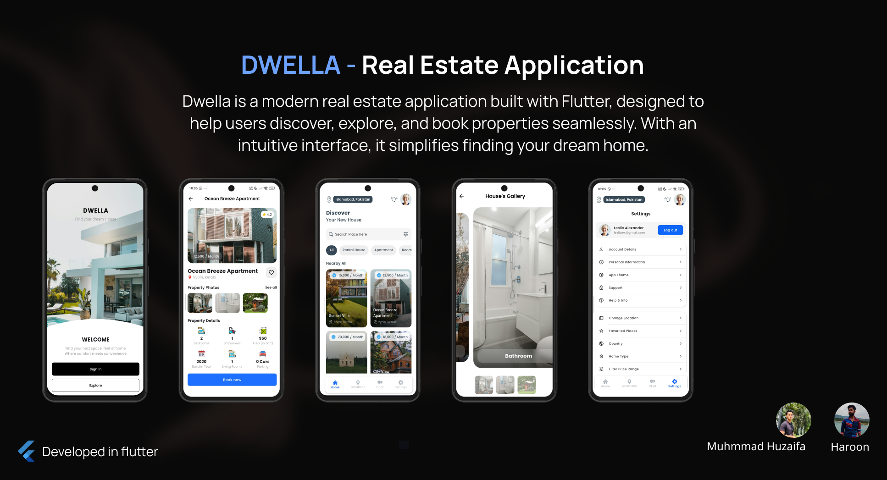

# 🏡 Dwella - Real Estate Application

**Dwella** is a modern real estate application built with **Flutter**, designed to help users discover, explore, and book properties seamlessly. With an intuitive interface, it simplifies finding your dream home.

---

## 🖼️ Project Banner

<div align="center">
  
</div>

---

## ✨ Features

- 🔍 **Property Discovery**
  - Browse properties by type (rental, house, apartment, room, etc.)
  - Filter by location, price, amenities, and more  

- 🏠 **Property Details**
  - High-quality photos & galleries
  - Property specifications (beds, baths, area, parking, etc.)
  - Owner/agent information  

- 📅 **Booking & Scheduling**
  - Book viewings directly in the app
  - Track reservations & manage favorites  

- 👤 **User Account**
  - Sign up, sign in, manage personal information
  - Save & revisit favorite listings  

- 🎨 **Modern Flutter UI**
  - Smooth navigation & elegant design
  - Dark/light theme support  

---

## 🏗️ Tech Stack

| Layer | Technology |
|-------|------------|
| Framework | Flutter (Dart) |
| Backend | Firebase |
| Database | Firestore  |
| Auth | Firebase Authentication |
| State Management | Provider |

---

## 🚀 Getting Started

### Prerequisites
- Install [Flutter SDK](https://docs.flutter.dev/get-started/install)  
- Setup emulator / connect a device  
- Clone this repository  

### Installation

```bash
git clone https://github.com/your-username/dwella.git
cd dwella
flutter pub get
